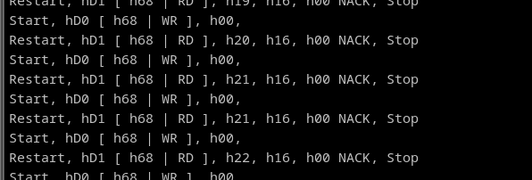
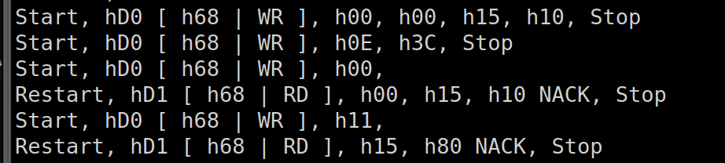

# Programming an I2C Protocal in Assembly

In this project we aimed to recreate the I2C protocal to communicate with an real-time-clock (RTC). This included recreation of the SDA and SCL lines; where SDA is the data line and SCL is the clock line, in order to synchronize and send data between the microcontroller (MSP430FR2355) and the RTC (DS3231).

When writing and reading from the i2c bus, the following shows the behavior of the project with regards to reading the time alone.

    

Then with also reading the temperature registers:

    

---

The following is the circuit diagram used between the RTC and MSP.

    

The following is the main flowchart for how the code should perform; where it first writes the time, writes the control bit to set temperature conversion on the rtc, reads time (seconds, minutes, hours), reads temperature, and finally loops back to setting the control bit for temperature conversion.

    

Here is a flowchart for how the i2c_tx_byte subroutine works:

    

Here is a flowchart for how the i2c_rx_byte subroutine works:

    

Here is a flowchart for how the i2c_write subroutine works:

    

Here is a flowchart for how the i2c_read subroutine works:

    

Here is a flowchart for how the i2c_ack subroutine works:

    

Here is a flowchart for how the i2c_nack subroutine works:

    

Here is a flowchart for how the i2c_ack_delay subroutine works:

    

